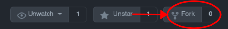
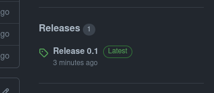

## Hey 👋, Nice to see you here 

### This Repo is a public version of my previous [portflio](https://takshakramteke.github.io)

<br/>

## How to use this : 

## Step 1: 

- Either Fork this repo by clicking the fork button in top right 

<br/>

<div align="center">
    
</div>

<br/>

- Or download the latest release from the release section

<br/>

<div align="center">
    
</div>

## Step 2 :

- Change the Tittle of the website to your name in index.html at ```line no. 10```
<br/>
``` html
<head>
    ...
    <title>Your Name</title>
    ...
</head>
```
<br/>

## Step 3 :

- Replace all the occurences of "Your Name" with "your Actual Name" and add a little introduction of yours between ``` line 27 to 28```.

- Add the links to your socials like Github, Twitter, Linkedin, and Email in the contact section at ``` line 36, 41, 46 & 51``` of index.html respectively.

<br/>

## Step 4 : 

- Add some of your key skills that you'd love to flex (💪) add them at ``` Line 65, 69, 73```

- To adjust the percentage of progess bar you can edit the width property of skill class for that skill e.g. To edit the percentage of skill 1 from 75% to 85% edit the index.CSS file as follows at ```line 26``` :

```diff
.skills_list .skill1{
     padding-top: 2%;
     height: 2em;
-    width: 75%;
     border-radius: 2em;
}
```
To 

```diff
.skills_list .skill1{
     padding-top: 2%;
     height: 2em;
+    width: 85%;
     border-radius: 2em;
}
```
<br/>

## Step 5 :
 
- To Customize the "Tech I' m familiar with" section, You Can add the image of the skill you want to add into the ```images/icons/tech``` directory / folder 

- Then just copy the code from ```line 82 to 85``` and paste it between ```line 98 and 99``` and change the code as follows :

```diff
<div>
+    
+    <p>{The name of skill you want to add}</p>
</div>
```
```note : Here we changed the path of the image so that it shows the image you just added```

<br/>

## Step 6 : 

- To edit the "Experience" Section,
- Add the start and end date of your experience at ``` line 107 ``` ,
- Add the name the post of the your Experience at ``` line 109 ```,
- Add the Organization where you worked for this pirticualr experience at ``` line 110 ```.
- And walla Your experience section is done ✨ 
- Repeat this Same process for the Volunteering Section as it's almost the same.

<br/>

## Step 7 :

- Adding Projects is a great way of showing what you've learned and how you've evolved over time.

<br/>

- To add a project in this Template you need to :
    - Add an image of your project to the ``` images/projects/ ``` folder,
    - After you've added the project image edit the ``` line 173 ``` of index.html to use the currently added image e.g:

    ```html
    at line 173
        
    ```
    - Then at ``` Line 174 ``` add the Name of your Project,
    - After that at ```line 175 ```  add the date at which you started the project and if you're done with the project add an End date or if your currently working on the project add "Present" as the end date.
    - At ``` line 177 ``` add a vey small description about your project,
    - And finally at ``` line 179 ``` in the ```href = ``` part add the link to your Project

- To add your Resume at the ending of the code at ``` Line 209 ``` add the link to your Resume in the ``` href = "link" ``` place.

<br/>

### And that about Sums up the Customization part of your portfolio, At This Point Youll Most Likely Have a completed Portfolio 

<br/>

---
Note : If your Having any diffuculties please feel free to open a issue [here](http://github.com/TakshakRamteke/portfolio-template/issues/new)

---

<br/>

### you can easily host this portfolio using [GitHub pages](https://docs.github.com/en/pages/getting-started-with-github-pages/creating-a-github-pages-site)
